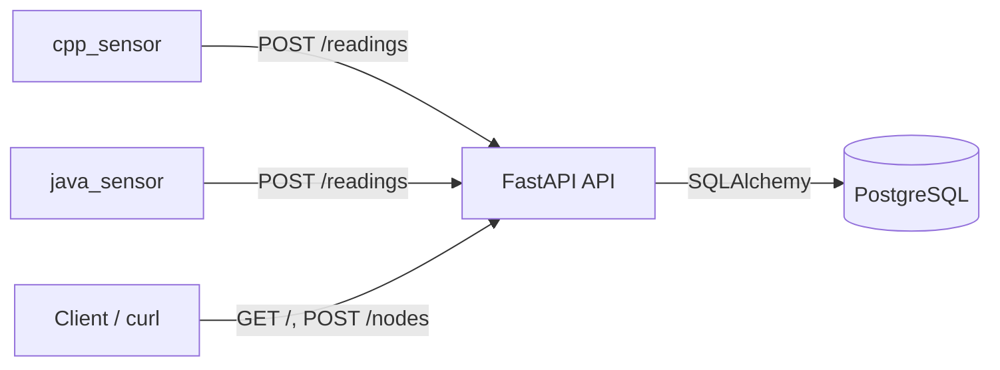

# Grid Monitor API

- FastAPI backend with PostgreSQL storage
- Alembic migrations
- Two producer services that generate synthetic readings:
  - [C++ sensor](cpp_sensor/src/main.cpp)
  - [Java sensor](java_sensor/src/SensorClient.java)

## Architecture



### Smoke test

Run the full local check without setting anything up manually:

Docker must be running first.

```bash
bash scripts/smoke-test.sh
```

The script creates `.env` from `.env.example` if needed, starts the database and API, exercises the node and reading endpoints, verifies the monitoring incidents in PostgreSQL, and builds the sensor images.

## API examples

### `GET /`

```bash
curl -s http://localhost:8000/
```
```json
{"message":"online!"}
```

### `POST /nodes/`

```bash
curl -s -X POST http://localhost:8000/nodes/ \
  -H "Content-Type: application/json" \
  -d '{"name":"Node 1","location":"Lab"}'
```
```json
{
  "name": "Node 1",
  "location": "Lab",
  "id": 1
}
```

### `POST /readings/`

```bash
curl -s -X POST http://localhost:8000/readings/ \
  -H "Content-Type: application/json" \
  -d '{"node_id":1,"voltage":220.4,"load":410.2}'
```
```json
{
  "node_id": 1,
  "voltage": 220.4,
  "load": 410.2,
  "id": 12,
  "timestamp": "2026-04-19T13:30:00.000000Z"
}
```

## Setting up

1. Create a local env file.

```bash
cp .env.example .env
```

2. Build and start everything.

```bash
docker compose up --build -d
```

3. Create a node used by sensors (`node_id=1`).

```bash
curl -X POST http://localhost:8000/nodes/ \
  -H "Content-Type: application/json" \
  -d '{"name":"Node 1","location":"Lab"}'
```

4. Verify the API.

```bash
curl http://localhost:8000/
```

5. Tail logs.

```bash
docker compose logs -f api cpp_sensor java_sensor
```

## Notes

- Incident rules are implemented in `app/services/monitoring.py`.
- Alembic reads `DATABASE_URL` from `.env` in `migrations/env.py`.
- Sensors can fail briefly at startup before the API is fully ready; this is expected in local compose boot.