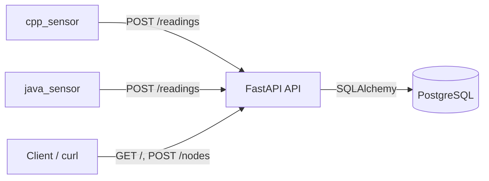

# Grid Monitor API

[](https://github.com/jismailov/monitor-api/actions/workflows/ci.yml)
[](https://www.python.org/downloads/)
[](https://fastapi.tiangolo.com/)
[](https://www.postgresql.org/)
[](LICENSE)

Small, clean pet project for grid monitoring simulation.

It includes:
- FastAPI backend with PostgreSQL storage
- Alembic migrations
- Two producer services that generate synthetic readings:
  - C++ sensor (`cpp_sensor`)
  - Java sensor (`java_sensor`)

## Architecture



## Project tree

```text
├── .github/workflows/    # CI pipeline
├── app/                  # API code (routes, models, services, db)
├── migrations/           # Alembic setup + migration versions
├── cpp_sensor/           # C++ sensor service
│   └── src/main.cpp
├── java_sensor/          # Java sensor service
│   └── src/SensorClient.java
├── docker-compose.yml    # Multi-service local stack
├── Dockerfile            # API image
├── requirements.txt      # Python dependencies
├── .env.example          # Environment template
└── LICENSE
```

## Quick start

1. Create local env file:

```bash
cp .env.example .env
```

2. Build and start everything:

```bash
docker compose up --build -d
```

3. Create a node used by sensors (`node_id=1`):

```bash
curl -X POST http://localhost:8000/nodes/ \
  -H "Content-Type: application/json" \
  -d '{"name":"Node 1","location":"Lab"}'
```

4. Verify API:

```bash
curl http://localhost:8000/
```

5. Tail logs:

```bash
docker compose logs -f api cpp_sensor java_sensor
```

## API examples

### `GET /`

```bash
curl -s http://localhost:8000/
```

Example response:

```json
{"message":"online!"}
```

### `POST /nodes/`

```bash
curl -s -X POST http://localhost:8000/nodes/ \
  -H "Content-Type: application/json" \
  -d '{"name":"Node 1","location":"Lab"}'
```

Example response:

```json
{"name":"Node 1","location":"Lab","id":1}
```

### `POST /readings/`

```bash
curl -s -X POST http://localhost:8000/readings/ \
  -H "Content-Type: application/json" \
  -d '{"node_id":1,"voltage":220.4,"load":410.2}'
```

Example response:

```json
{"node_id":1,"voltage":220.4,"load":410.2,"id":12,"timestamp":"2026-04-19T13:30:00.000000Z"}
```

## Development notes

- Incident rules are implemented in `app/services/monitoring.py`.
- Alembic reads `DATABASE_URL` from `.env` in `migrations/env.py`.
- Sensors can fail briefly at startup before the API is fully ready; this is expected in local compose boot.

## License

MIT - see [LICENSE](LICENSE).